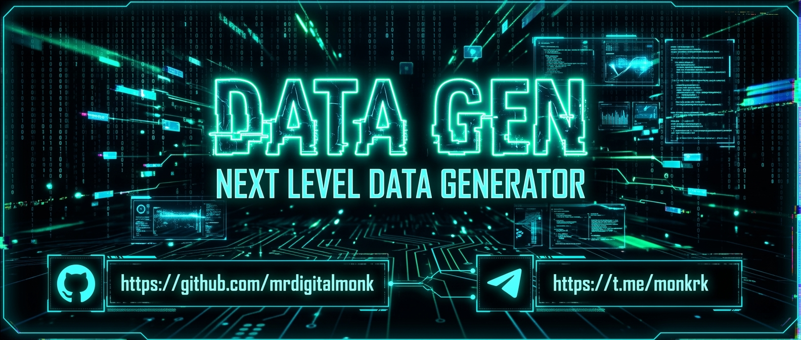
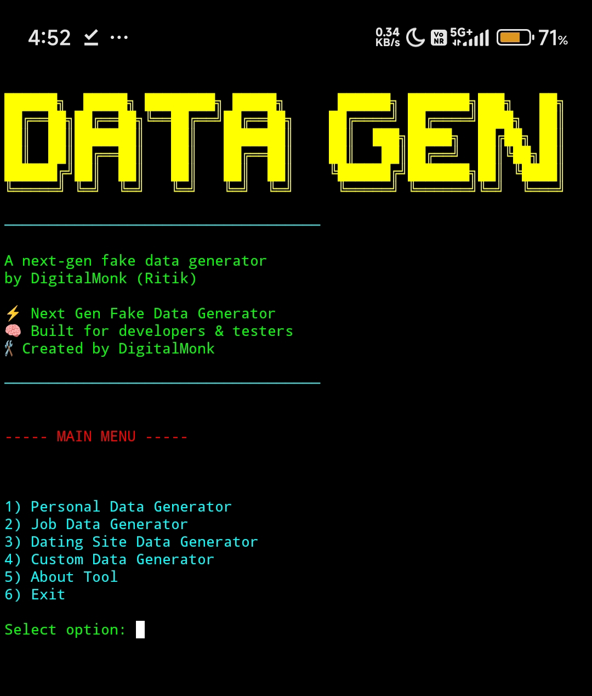

# ⚡ DATA GEN



> Next Level Data Generator
> CLI Developer Toolkit
> Smart Dataset Engine
> Built for Developers & Testers

[](https://github.com/mrdigitalmonk/DataGen/stargazers)
[](https://github.com/mrdigitalmonk/DataGen/network/members)
[](https://github.com/mrdigitalmonk/DataGen/issues)
[](https://github.com/mrdigitalmonk/DataGen)

---

## 🧠 Tool

⚡ Next Level Data Generator  
🧠 Built for developers & testers  
⚙️ CLI based smart dataset engine  
🚀 Fast structured data generation  
🛠 Created by DigitalMonk  

---

## 📸 Tool Preview



---

## 🔥 Capabilities

⚡ Personal Data Generator  
⚡ Job Profile Data Generator  
⚡ Dating Profile Dataset Generator  
⚡ Custom Dataset Builder  
⚡ Country based dataset generation  
⚡ JSON structured export  
⚡ High volume dataset support (1 → 100000)

---

## ⚙️ Installation

```bash
git clone [https://github.com/mrdigitalmonk/DataGen](https://github.com/mrdigitalmonk/DataGen)
cd DataGen
pip install -r requirements.txt
python3 datagen.py
```

---

## 📦 Requirements

`faker`

---

## 💻 Interface Modules

1️⃣ Personal Data Generator  
2️⃣ Job Data Generator  
3️⃣ Dating Site Data Generator  
4️⃣ Custom Data Generator  
5️⃣ About Tool  
6️⃣ Exit  

---

## 🔗 Developer

[](https://github.com/mrdigitalmonk)
[](https://t.me/monkrk)

---

## 👀 Visitors


---

⭐ Star the repository if you like the project  
⚡ Built with passion by DigitalMonk
